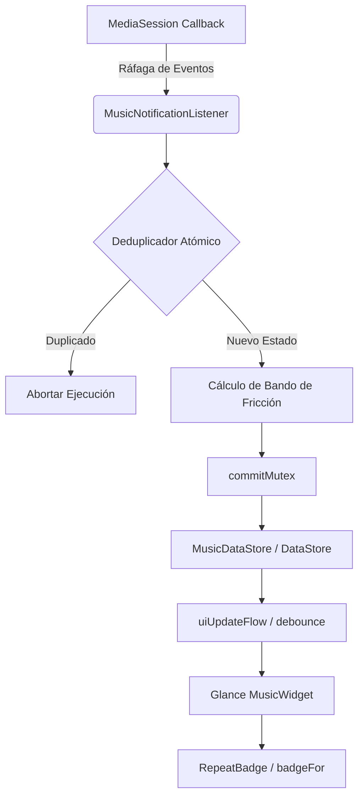

# Auditoría Técnica: Sistema de Streaks y Blindaje de Persistencia
**Versión:** 1.0
**Estado:** Implementación Finalizada y Validada
**Rol:** Arquitectura de Software y Documentación Técnica Sénior

## 1. Introducción y Contexto del Problema

El sistema de Music Widget presentaba una anomalía crítica en el conteo de rachas (streaks) y el historial de reproducción. Un solo evento de interacción del usuario (especialmente "skips" o cambios de canción) resultaba en un sobreconteo, donde una sola acción se registraba 2 o 3 veces de forma casi instantánea en la capa de persistencia (`DataStore`).

### El Punto Ciego de la Arquitectura Original
La arquitectura original contaba con un `uiUpdateFlow` protegido por un `debounce(150L)` para evitar parpadeos en Glance. Sin embargo, este escudo era puramente visual. La **capa de negocio y persistencia** estaba totalmente expuesta a ráfagas (bursts) de callbacks provenientes de `MediaSession` y el hardware del dispositivo.

Al ocurrir un cambio de metadatos, Spotify u otros reproductores disparan múltiples actualizaciones en milisegundos. Cada actualización atravesaba el `Channel` de historial y ejecutaba una transacción en `DataStore` antes de que el estado anterior se hubiera consolidado, multiplicando las rachas debido a la concurrencia asíncrona.

---

## 2. Fase 1: El Escudo de Deduplicación Atómica

Para resolver el sobreconteo, se inyectó un **Deduplicador Atómico en Memoria** dentro del `MusicNotificationListener.kt`. Este escudo actúa interceptando los eventos antes de que toquen el `commitMutex` o el `DataStore`.

### Lógica de Decisión
Se descartó el uso de un simple `debounce` en la lógica de negocio porque esto retrasaría la persistencia de datos críticos. En su lugar, se optó por una validación de estado basado en la identidad de la pista y el resultado (`outcome`) calculado.

### Implementación en `MusicNotificationListener.kt` (Verbatim)

```kotlin
// 1. Declaración de estado volátil para rastreo de ráfagas
private var lastProcessedTrack: String? = null
private var lastProcessedOutcome: String? = null

// ... (Dentro de la clase MusicNotificationListener)

private suspend fun processHistoryEvent(snapshot: MediaSnapshot) {
    try {
        // ... (Lógica de creación de directorios y resolución de artwork)

        // 2. Clasificación de 3 Bandas con Motor Maestro
        val finalPos = calculateEffectiveProgress(snapshot)
        val progressFactor = if (snapshot.durationMs > 0) {
            finalPos.toFloat() / snapshot.durationMs.toFloat()
        } else {
            1.0f
        }

        val isSkipped = progressFactor < 0.4f
        val isPartial = progressFactor >= 0.4f && progressFactor < 0.85f

        val outcome = when {
            isSkipped -> "SKIPPED"
            isPartial -> "PARTIAL"
            else -> "COMPLETED"
        }

        // BLOQUEO ESTRICTO: Descarta callbacks duplicados de la misma canción y resultado en ráfaga
        if (snapshot.trackKey == lastProcessedTrack && outcome == lastProcessedOutcome) {
            Log.d(TAG, "[DIAGNOSTIC] DEDUPLICATOR: Evento duplicado bloqueado para ${snapshot.title} ($outcome)")
            return
        }

        lastProcessedTrack = snapshot.trackKey
        lastProcessedOutcome = outcome

        // 3. Ejecución hacia DataStore (Zona de Seguridad)
        val newStreak = musicDataStore.updateSkipStreak(
            snapshot.title,
            snapshot.artist,
            isSkip = isSkipped,
            isPartial = isPartial
        )

        // ... resto de la lógica de persistencia
    } catch (e: Exception) {
        Log.e(TAG, "Error procesando evento de historial para ${snapshot.title}", e)
    }
}
```

---

## 3. Fase 2: Rigor en Modelos y Umbrales (La Ley de los 3)

Se redefinió la semántica de lo que constituye una "racha" para elevar el estándar de fidelidad del widget. Se implementó un motor de umbrales centralizado para evitar lógica dispersa en la UI.

### Definiciones Técnicas en `MusicDataStore.kt` (Verbatim)

```kotlin
/**
 * Identidad visual de la racha/repetición.
 */
enum class RepeatBadge {
    NONE,
    HOT_TODAY,      // Umbral: 3 veces hoy
    ONGOING_STREAK  // Umbral: 3 días seguidos
}

/**
 * Motor Maestro de Umbrales: Determina si una canción merece un badge.
 * Garantiza que la lógica de negocio sea la única fuente de verdad.
 */
fun badgeFor(stats: RepeatStats?, todayEpochDay: Long): RepeatBadge {
    if (stats == null) return RepeatBadge.NONE

    // Si el gap es mayor a 1 día, la racha se rompió lógicamente
    val gap = todayEpochDay - stats.lastPlayedEpochDay
    if (gap > 1) return RepeatBadge.NONE

    return when {
        stats.streakDays >= 3 -> RepeatBadge.ONGOING_STREAK
        gap == 0L && stats.playsToday >= 3 -> RepeatBadge.HOT_TODAY
        else -> RepeatBadge.NONE
    }
}
```

---

## 4. Fase 3: Presentación y Revelación Progresiva

En la capa de UI (`MusicWidget.kt`), se implementó una lógica de **Revelación Progresiva** para los skips. El objetivo era dar feedback inmediato (icono) pero reservar el contador numérico para casos de rechazo recurrente.

### Lógica Progresiva:
- **1er y 2do Skip:** Solo se muestra el icono en la píldora.
- **3er Skip en adelante:** Se muestra el icono + contador ("3x", "4x", etc.).

### Implementación del Componente `DesignBadge` (Verbatim)

```kotlin
    /**
     * Componente de Badge siguiendo Material 3 Expressive.
     * Implementa Microcopy (x/d) y posicionamiento Trailing.
     *
     * Refactorizado para soportar estados de "solo icono" sin artefactos visuales.
     */
    @Composable
    private fun DesignBadge(iconRes: Int, label: String, isTonal: Boolean = true) {
        Row(
            modifier = GlanceModifier
                .background(if (isTonal) GlanceTheme.colors.tertiaryContainer else GlanceTheme.colors.surfaceVariant)
                .cornerRadius(100.dp)
                .padding(horizontal = 8.dp, vertical = 2.dp),
            verticalAlignment = Alignment.CenterVertically
        ) {
            Image(
                provider = ImageProvider(iconRes),
                contentDescription = null,
                colorFilter = ColorFilter.tint(if (isTonal) GlanceTheme.colors.onTertiaryContainer else GlanceTheme.colors.onSurfaceVariant),
                modifier = GlanceModifier.size(12.dp)
            )
            // Lógica de supresión de espacio para badges de solo icono
            if (label.isNotEmpty()) {
                Spacer(modifier = GlanceModifier.size(3.dp))
                Text(
                    text = label,
                    style = TextStyle(
                        color = if (isTonal) GlanceTheme.colors.onTertiaryContainer else GlanceTheme.colors.onSurfaceVariant,
                        fontSize = 10.sp,
                        fontWeight = FontWeight.Bold
                    )
                )
            }
        }
    }
```

---

## 5. Fase 4: Optimización de Contraste y Material Design 3

El último paso consistió en una auditoría visual de accesibilidad. Los badges en el historial utilizaban `secondaryContainer`, lo cual proporcionaba un contraste insuficiente sobre el fondo `surfaceVariant` de las tarjetas.

### Decisión de Diseño
Se migró la paleta del badge a la familia **Tertiary**. En Material Design 3, la paleta terciaria se utiliza para acentos de contraste que equilibran los colores primarios y secundarios, siendo ideal para métricas analíticas que deben resaltar sin dominar la jerarquía.

### Implementación de Analítica en `MusicWidget.kt` (Verbatim)

```kotlin
    @Composable
    private fun RepeatAnalyticsBadge(info: MusicInfo) {
        val badge = when {
            info.streakDays >= 3 -> Pair(R.drawable.replay_24px, "${info.streakDays}d")
            info.playsToday >= 3 -> Pair(R.drawable.mode_heat_24px, "${info.playsToday}x")
            // Los skips aparecen desde el primero, pero el contador desde el tercero
            info.skipStreak >= 1 -> Pair(R.drawable.skip_next_24px, if (info.skipStreak >= 3) "${info.skipStreak}x" else "")
            else -> null
        } ?: return

        DesignBadge(iconRes = badge.first, label = badge.second, isTonal = true)
    }

    // Integración en HistoryItemRow
    @Composable
    private fun HistoryItemRow(context: Context, item: HistoryItem) {
        // ... lógica de carga de bitmap ...

        Row(modifier = GlanceModifier.fillMaxWidth().background(GlanceTheme.colors.surfaceVariant).cornerRadius(16.dp)...) {
            // ... contenido de la fila ...

            // Trailing Badge Area: Refleja los nuevos umbrales de rigor
            Row(verticalAlignment = Alignment.CenterVertically) {
                if (item.streakDays >= 3) {
                    DesignBadge(iconRes = R.drawable.replay_24px, label = "${item.streakDays}d", isTonal = true)
                } else if (item.playsToday >= 3) {
                    DesignBadge(iconRes = R.drawable.mode_heat_24px, label = "${item.playsToday}x", isTonal = true)
                } else if (item.isSkipped && item.skipStreak >= 1) {
                    DesignBadge(iconRes = R.drawable.skip_next_24px, label = if (item.skipStreak >= 3) "${item.skipStreak}x" else "", isTonal = true)
                }
            }
        }
    }
```

---

## 6. Arquitectura Resultante y Flujo de Datos



### Resumen de Estándares Aplicados:
1. **Inmunidad a Ráfagas:** Garantizada por el deduplicador en memoria.
2. **Determinismo de Datos:** Los umbrales de "3" son constantes en toda la aplicación.
3. **Accesibilidad Visual:** Contraste mejorado mediante `tertiaryContainer`.
4. **Eficiencia en Glance:** `DesignBadge` optimizado para evitar renderizado innecesario de componentes de texto vacíos.

---
**Fin del Documento Técnico.**
